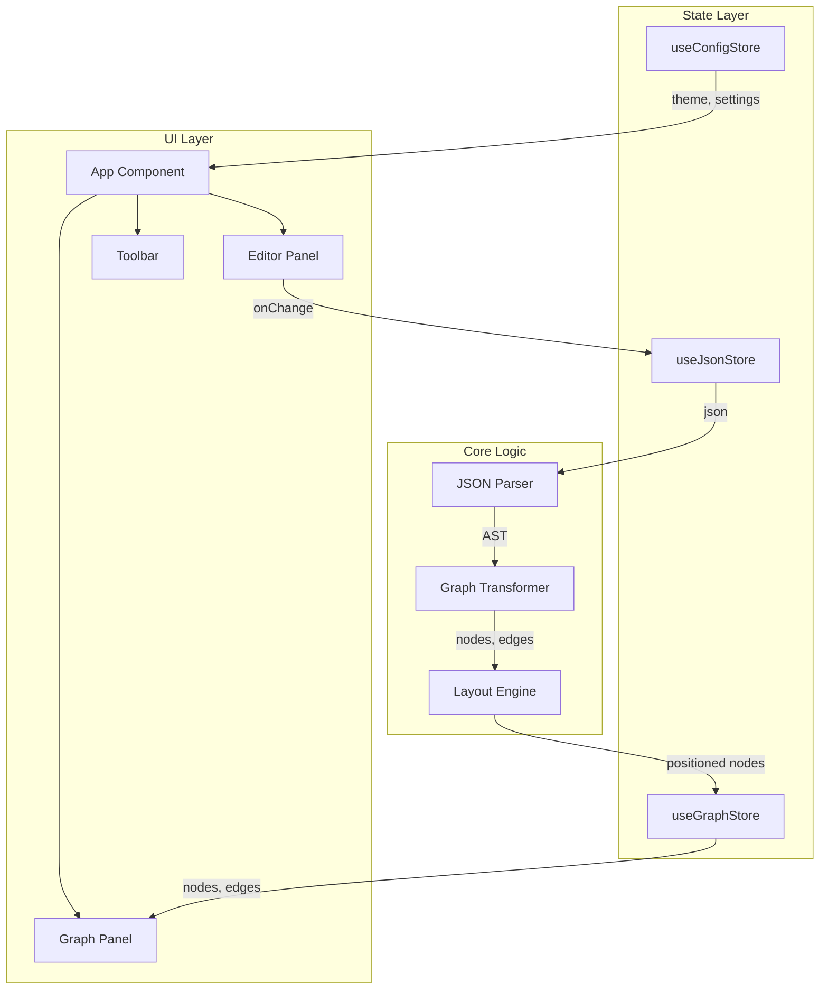
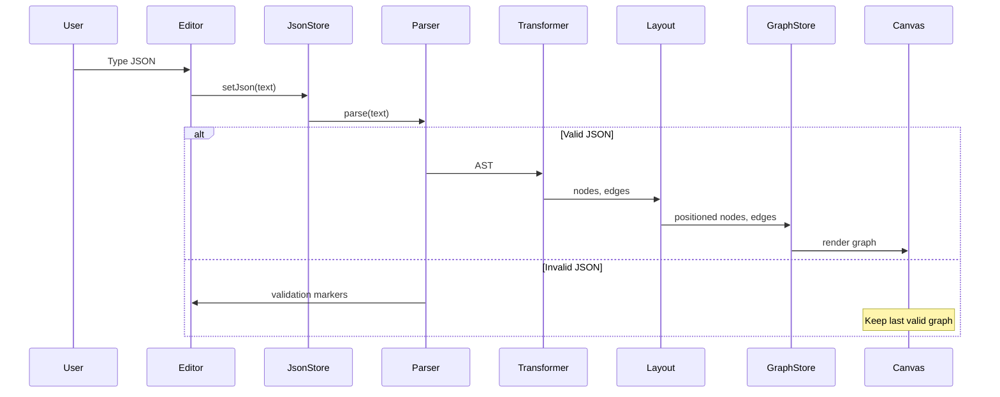

# JSON Visualizer - Detailed Design Document

## 1. Overview

A web-based JSON visualization tool that transforms JSON data into interactive graph representations. Users can input JSON in an editor, and instantly see it rendered as a navigable node-based diagram.

### 1.1 Goals
- Provide real-time JSON → graph visualization
- Support standard graph interactions (pan, zoom, collapse/expand)
- Deliver a polished developer tool experience with dark mode support
- Process all data client-side (no server required)

### 1.2 Non-Goals (MVP)
- Multi-format support (YAML, XML, CSV, TOML)
- Code generation (TypeScript, Go, Rust)
- URL sharing or cloud storage
- Image export (PNG, SVG)

---

## 2. Detailed Requirements

### 2.1 Functional Requirements

| ID | Requirement | Priority |
|----|-------------|----------|
| FR-01 | Parse valid JSON and display as graph | Must |
| FR-02 | Show inline error markers for invalid JSON | Must |
| FR-03 | Keep last valid graph when JSON becomes invalid | Must |
| FR-04 | Pan and zoom the graph canvas | Must |
| FR-05 | Click nodes to highlight them | Must |
| FR-06 | Collapse/expand object and array nodes | Must |
| FR-07 | Color-code nodes by JSON type | Must |
| FR-08 | Layout graph left-to-right | Must |
| FR-09 | Save JSON to localStorage | Should |
| FR-10 | Restore last session on load | Should |
| FR-11 | Support dark/light theme with system detection | Should |
| FR-12 | Block rendering for JSON > 300KB | Should |

### 2.2 Non-Functional Requirements

| ID | Requirement | Target |
|----|-------------|--------|
| NFR-01 | Initial render time | < 500ms for 50KB JSON |
| NFR-02 | Re-render on edit | < 200ms debounced |
| NFR-03 | Bundle size | < 500KB gzipped |
| NFR-04 | Browser support | Chrome, Firefox, Safari, Edge (latest 2 versions) |

---

## 3. Architecture Overview



### 3.1 Data Flow



---

## 4. Components and Interfaces

### 4.1 Component Hierarchy

```
App
├── ThemeProvider
├── Toolbar
│   ├── ThemeToggle
│   ├── ZoomControls
│   └── SizeWarning
├── Allotment (Split Pane)
│   ├── EditorPanel
│   │   └── MonacoEditor
│   └── GraphPanel
│       └── ReactFlow
│           ├── JsonNode (custom)
│           ├── JsonEdge (custom)
│           ├── Background
│           └── Controls
```

### 4.2 Component Specifications

#### App
```typescript
interface AppProps {}

// Responsibilities:
// - Initialize stores
// - Load saved state from localStorage
// - Provide theme context
// - Render main layout
```

#### EditorPanel
```typescript
interface EditorPanelProps {
  value: string;
  onChange: (value: string) => void;
  onValidate: (markers: IMarker[]) => void;
}

// Responsibilities:
// - Render Monaco Editor with JSON language
// - Handle text changes (debounced)
// - Display validation errors inline
```

#### GraphPanel
```typescript
interface GraphPanelProps {
  nodes: JsonNode[];
  edges: JsonEdge[];
  onNodeClick: (node: JsonNode) => void;
}

// Responsibilities:
// - Render React Flow canvas
// - Handle pan/zoom interactions
// - Manage node selection state
```

#### JsonNode (Custom React Flow Node)
```typescript
interface JsonNodeData {
  id: string;
  type: 'object' | 'array' | 'string' | 'number' | 'boolean' | 'null';
  label: string;
  value?: string | number | boolean | null;
  childCount?: number;
  path: (string | number)[];
  collapsed: boolean;
}

// Responsibilities:
// - Render node with appropriate color
// - Display key/value or type indicator
// - Handle collapse/expand toggle
// - Show child count when collapsed
```

---

## 5. Data Models

### 5.1 JSON AST (from jsonc-parser)

```typescript
interface ASTNode {
  type: 'object' | 'array' | 'string' | 'number' | 'boolean' | 'null' | 'property';
  offset: number;
  length: number;
  children?: ASTNode[];
  value?: any;
}
```

### 5.2 Graph Node

```typescript
interface JsonNode {
  id: string;
  type: 'jsonNode';  // React Flow node type
  position: { x: number; y: number };
  data: JsonNodeData;
}

interface JsonNodeData {
  nodeType: 'object' | 'array' | 'string' | 'number' | 'boolean' | 'null';
  label: string;           // Key name or array index
  value?: string;          // Display value for primitives
  childCount?: number;     // Number of children
  path: JsonPath;          // Path in JSON structure
  collapsed: boolean;      // Collapse state
}

type JsonPath = (string | number)[];
```

### 5.3 Graph Edge

```typescript
interface JsonEdge {
  id: string;
  source: string;
  target: string;
  type: 'smoothstep';
}
```

### 5.4 Store Interfaces

```typescript
// JSON Store
interface JsonState {
  json: string;
  isValid: boolean;
  error: string | null;
  setJson: (json: string) => void;
}

// Graph Store
interface GraphState {
  nodes: JsonNode[];
  edges: JsonEdge[];
  selectedNodeId: string | null;
  collapsedNodes: Set<string>;
  setGraph: (nodes: JsonNode[], edges: JsonEdge[]) => void;
  selectNode: (id: string | null) => void;
  toggleCollapse: (id: string) => void;
}

// Config Store
interface ConfigState {
  theme: 'light' | 'dark' | 'system';
  setTheme: (theme: 'light' | 'dark' | 'system') => void;
}
```

---

## 6. Core Algorithms

### 6.1 JSON to Graph Transformation

```typescript
function transformJsonToGraph(json: string): { nodes: JsonNode[], edges: JsonEdge[] } {
  const ast = parseTree(json);
  if (!ast) return { nodes: [], edges: [] };

  const nodes: JsonNode[] = [];
  const edges: JsonEdge[] = [];
  let nodeId = 0;

  function traverse(node: ASTNode, parentId: string | null, key: string | null, path: JsonPath) {
    const id = `node-${++nodeId}`;

    const graphNode: JsonNode = {
      id,
      type: 'jsonNode',
      position: { x: 0, y: 0 },  // Set by layout engine
      data: {
        nodeType: node.type,
        label: key ?? (node.type === 'array' ? '[]' : '{}'),
        path,
        collapsed: false,
        childCount: node.children?.length,
        value: isPrimitive(node) ? formatValue(node.value) : undefined,
      },
    };

    nodes.push(graphNode);

    if (parentId) {
      edges.push({
        id: `edge-${parentId}-${id}`,
        source: parentId,
        target: id,
        type: 'smoothstep',
      });
    }

    if (node.type === 'object' && node.children) {
      node.children.forEach((prop) => {
        const propKey = prop.children?.[0].value;
        const propValue = prop.children?.[1];
        if (propValue) {
          traverse(propValue, id, propKey, [...path, propKey]);
        }
      });
    } else if (node.type === 'array' && node.children) {
      node.children.forEach((item, index) => {
        traverse(item, id, `[${index}]`, [...path, index]);
      });
    }
  }

  traverse(ast, null, null, []);
  return { nodes, edges };
}
```

### 6.2 Dagre Layout

```typescript
function applyLayout(nodes: JsonNode[], edges: JsonEdge[]): JsonNode[] {
  const g = new dagre.graphlib.Graph();
  g.setGraph({ rankdir: 'LR', nodesep: 50, ranksep: 100 });
  g.setDefaultEdgeLabel(() => ({}));

  nodes.forEach((node) => {
    const dimensions = calculateNodeDimensions(node.data);
    g.setNode(node.id, { width: dimensions.width, height: dimensions.height });
  });

  edges.forEach((edge) => {
    g.setEdge(edge.source, edge.target);
  });

  dagre.layout(g);

  return nodes.map((node) => {
    const position = g.node(node.id);
    return {
      ...node,
      position: {
        x: position.x - position.width / 2,
        y: position.y - position.height / 2,
      },
    };
  });
}
```

### 6.3 Node Dimension Calculation

```typescript
function calculateNodeDimensions(data: JsonNodeData): { width: number; height: number } {
  const BASE_WIDTH = 150;
  const BASE_HEIGHT = 40;
  const CHAR_WIDTH = 8;

  const labelLength = data.label.length;
  const valueLength = data.value?.toString().length ?? 0;
  const contentLength = Math.max(labelLength, valueLength);

  const width = Math.max(BASE_WIDTH, contentLength * CHAR_WIDTH + 40);
  const height = BASE_HEIGHT;

  return { width, height };
}
```

---

## 7. Error Handling

### 7.1 JSON Parsing Errors

```typescript
function handleJsonChange(text: string) {
  try {
    // Validate JSON syntax
    const errors = [];
    parseTree(text, errors);

    if (errors.length > 0) {
      // Convert to Monaco markers
      const markers = errors.map(err => ({
        severity: 8, // Error
        message: err.error.toString(),
        startLineNumber: getLineNumber(text, err.offset),
        startColumn: getColumn(text, err.offset),
        endLineNumber: getLineNumber(text, err.offset + err.length),
        endColumn: getColumn(text, err.offset + err.length),
      }));

      setValidationMarkers(markers);
      setIsValid(false);
      // Keep previous valid graph
      return;
    }

    setIsValid(true);
    setValidationMarkers([]);
    updateGraph(text);

  } catch (e) {
    // Fallback error handling
    setIsValid(false);
  }
}
```

### 7.2 Size Limit Handling

```typescript
const MAX_SIZE_BYTES = 300 * 1024; // 300KB

function checkSizeLimit(json: string): boolean {
  const sizeBytes = new Blob([json]).size;
  return sizeBytes <= MAX_SIZE_BYTES;
}

// In component
if (!checkSizeLimit(json)) {
  showWarning('JSON exceeds 300KB limit. Visualization disabled.');
  return;
}
```

---

## 8. Testing Strategy

### 8.1 Unit Tests

| Component | Test Cases |
|-----------|------------|
| JSON Parser | Valid JSON, invalid JSON, edge cases (empty, nested, unicode) |
| Graph Transformer | Primitives, objects, arrays, nested structures, circular reference handling |
| Layout Engine | Single node, linear chain, branching tree, large graphs |
| Node Dimensions | Various content lengths, special characters |

### 8.2 Integration Tests

| Scenario | Expected Behavior |
|----------|-------------------|
| Type valid JSON | Graph updates in real-time |
| Type invalid JSON | Error markers shown, graph unchanged |
| Fix invalid JSON | Error clears, graph updates |
| Click node | Node highlights |
| Collapse node | Children hidden, count shown |
| Toggle theme | UI updates, graph re-renders |

### 8.3 E2E Tests

| Flow | Steps |
|------|-------|
| Basic usage | Load app → Paste JSON → Verify graph → Pan/zoom |
| Persistence | Enter JSON → Refresh page → Verify restored |
| Error recovery | Enter invalid → Fix → Verify graph |

---

## 9. Implementation Notes

This section provides concrete decisions for all implementation details.

### 9.1 JSON → Graph Mapping Rules

#### Node Representation by JSON Type

| JSON Type | Node Label | Node Content | Example |
|-----------|------------|--------------|---------|
| **Object** | Key name (or `Object` for root) | `{ }` + child count | `user { 3 }` |
| **Array** | Key name (or `Array` for root) | `[ ]` + child count | `items [ 5 ]` |
| **String** | Key name | Quoted value (truncated) | `name: "John..."` |
| **Number** | Key name | Numeric value | `age: 25` |
| **Boolean** | Key name | `true` / `false` | `active: true` |
| **Null** | Key name | `null` | `data: null` |

#### Label Format Rules

```typescript
// For object/array children (have a key)
label = `${key}`
content = isPrimitive ? formatValue(value) : `${type === 'array' ? '[]' : '{}'} ${childCount}`

// For array items (index as key)
label = `[${index}]`

// For root node (no key)
label = type === 'array' ? 'Array' : 'Object'

// Value truncation (consistent across all display text)
const MAX_DISPLAY_LENGTH = 40;  // Single source of truth
truncatedValue = value.length > MAX_DISPLAY_LENGTH
  ? value.slice(0, MAX_DISPLAY_LENGTH - 3) + '...'
  : value
```

#### Array Index Representation

- Array items are child nodes with label `[0]`, `[1]`, etc.
- Each array item creates an edge from parent array node
- Node display format (label + content on same node):
  - Primitive: label=`[0]`, content=`"value"` → displays as `[0]: "value"`
  - Object: label=`[0]`, content=`{ 3 }` → displays as `[0] { 3 }`
  - Array: label=`[0]`, content=`[ 2 ]` → displays as `[0] [ 2 ]`

#### Duplicate Keys

- JSON spec allows duplicate keys (last value wins in parsing)
- Each duplicate creates a separate node
- Nodes distinguished by unique IDs: `node-1`, `node-2`, etc.
- Path tracking uses array index for disambiguation

#### Edge Rules

```typescript
// All edges use smoothstep type
edgeType = 'smoothstep'

// Edge connects parent → child
// No edge labels (key info is on the child node)
// Edge color matches theme (gray in light, lighter gray in dark)
```

### 9.2 Collapse/Expand Behavior

#### Collapsible Nodes

- **Collapsible**: Object nodes and Array nodes with `childCount > 0`
- **Not collapsible**: Primitive nodes (string, number, boolean, null)

#### Collapse Mechanics

```typescript
// When collapsed:
// 1. Child nodes are REMOVED from the nodes array (not hidden)
// 2. Child edges are REMOVED from the edges array
// 3. Parent node shows child count badge: "{ 5 }" or "[ 3 ]"
// 4. Layout is recalculated with dagre

// When expanded (rehydration):
// 1. Look up the node's path in the original AST (stored on node.data.path)
// 2. Re-traverse that subtree of the AST
// 3. Generate new child nodes with STABLE IDs based on path:
//    - ID format: `node-${path.join('-')}`  e.g., "node-users-0-name"
//    - This ensures consistent IDs across collapse/expand cycles
// 4. Add child nodes and edges back to arrays
// 5. Recalculate layout with dagre

// Collapse state stored in GraphStore
collapsedNodes: Set<string>  // Set of node IDs that are collapsed

// Node ID generation (stable across toggles)
function generateNodeId(path: JsonPath): string {
  if (path.length === 0) return 'node-root';
  return `node-${path.map(p => String(p).replace(/[^a-zA-Z0-9]/g, '_')).join('-')}`;
}
```

#### Collapse State Persistence

```typescript
// Collapse state is NOT persisted to localStorage
// Rationale: JSON content may change between sessions
// All nodes start expanded on load
// User can collapse as needed during session
```

#### Visual Indicator

```typescript
// Collapsed node shows:
// - Collapse icon (chevron-right) instead of (chevron-down)
// - Child count in node content
// - Slightly different border style (dashed)

// Expand/collapse triggered by:
// - Click on chevron icon
// - Double-click on node body
```

### 9.3 Layout & Sizing Details

#### Node Dimensions

```typescript
const NODE_CONFIG = {
  MIN_WIDTH: 120,
  MAX_WIDTH: 300,
  HEIGHT: 40,
  PADDING_X: 16,
  PADDING_Y: 8,
  CHAR_WIDTH: 7.5,  // Approximate for monospace font
  FONT_SIZE: 13,
};

function calculateNodeWidth(data: JsonNodeData): number {
  const labelWidth = data.label.length * NODE_CONFIG.CHAR_WIDTH;
  const valueWidth = (data.value?.length ?? 0) * NODE_CONFIG.CHAR_WIDTH;
  const contentWidth = Math.max(labelWidth, valueWidth) + NODE_CONFIG.PADDING_X * 2;

  return Math.min(
    NODE_CONFIG.MAX_WIDTH,
    Math.max(NODE_CONFIG.MIN_WIDTH, contentWidth)
  );
}
```

#### Value Truncation & Ellipsis

```typescript
const MAX_DISPLAY_LENGTH = 40;

function formatDisplayValue(value: unknown): string {
  const str = JSON.stringify(value);
  if (str.length <= MAX_DISPLAY_LENGTH) return str;

  // Truncate with ellipsis
  return str.slice(0, MAX_DISPLAY_LENGTH - 3) + '...';
}

// Tooltip shows full value on hover (future enhancement)
```

#### Dagre Layout Parameters

```typescript
const DAGRE_CONFIG = {
  rankdir: 'LR',        // Left to right
  nodesep: 30,          // Vertical spacing between nodes
  ranksep: 80,          // Horizontal spacing between ranks
  edgesep: 10,          // Minimum edge separation
  marginx: 20,          // Graph margin
  marginy: 20,
};
```

### 9.4 Error Handling UX

#### Monaco Validation Markers

```typescript
// Severity levels from Monaco
const SEVERITY = {
  ERROR: 8,      // Red squiggly, used for syntax errors
  WARNING: 4,    // Yellow squiggly, not used in MVP
  INFO: 2,       // Blue squiggly, not used in MVP
};

// Marker creation from jsonc-parser errors
function createMarker(error: ParseError, text: string): IMarkerData {
  const { line, column } = offsetToPosition(text, error.offset);
  return {
    severity: SEVERITY.ERROR,
    message: getErrorMessage(error.error),  // Human-readable message
    startLineNumber: line,
    startColumn: column,
    endLineNumber: line,
    endColumn: column + error.length,
  };
}
```

#### Debounce Timing

```typescript
const DEBOUNCE_CONFIG = {
  TYPING_DEBOUNCE: 300,     // ms - delay before parsing after typing stops
  VALIDATION_DEBOUNCE: 150, // ms - delay before showing validation markers
  LAYOUT_DEBOUNCE: 100,     // ms - delay before re-layout after graph changes
};

// Immediate validation for:
// - Paste events (no debounce)
// - Format document command

// Debounced validation for:
// - Keystroke input
```

#### Size Warning Display

```typescript
// Location: Top of GraphPanel, overlay banner
// Appearance: Yellow/amber warning banner with icon
// Message: "JSON exceeds 300KB limit ({actualSize}KB). Visualization disabled."
// Behavior:
//   - Banner appears when size > MAX_SIZE
//   - Graph panel shows empty state with same message
//   - Editor remains functional (user can still edit)
//   - Banner dismisses automatically when size goes below limit
```

#### Invalid JSON Behavior

```typescript
// When JSON becomes invalid:
// 1. Parser returns errors array
// 2. Errors converted to Monaco markers (shown inline)
// 3. Graph state is NOT updated (keeps last valid graph)
// 4. Status indicator shows "Invalid JSON" (subtle, non-blocking)

// When JSON becomes valid again:
// 1. Markers cleared
// 2. New graph generated and displayed
// 3. Status indicator shows "Valid" or disappears
```

### 9.5 Persistence Schema

#### localStorage Keys

```typescript
const STORAGE_KEYS = {
  JSON_CONTENT: 'jsoncrack-clone:json',      // Raw JSON string
  THEME: 'jsoncrack-clone:theme',            // 'light' | 'dark' | 'system'
  EDITOR_STATE: 'jsoncrack-clone:editor',    // Monaco editor state (optional)
};

// Version prefix for future migrations
const STORAGE_VERSION = 'v1';
```

#### Stored Data Shape

```typescript
// JSON Content (stored as-is, string)
localStorage.setItem(STORAGE_KEYS.JSON_CONTENT, jsonString);

// Theme (stored as string)
localStorage.setItem(STORAGE_KEYS.THEME, 'dark');

// Editor state (optional, for cursor position)
interface EditorState {
  cursorPosition: { lineNumber: number; column: number };
  scrollTop: number;
}
localStorage.setItem(STORAGE_KEYS.EDITOR_STATE, JSON.stringify(editorState));
```

#### What is NOT Stored

- Graph state (nodes/edges) - regenerated from JSON
- Collapse states - reset on load
- Zoom/pan position - reset to fit-view on load
- Validation markers - regenerated from JSON

#### Load Sequence

```typescript
function loadSavedState() {
  // 1. Load theme first (prevents flash)
  const theme = localStorage.getItem(STORAGE_KEYS.THEME) ?? 'system';
  applyTheme(theme);

  // 2. Load JSON content
  const json = localStorage.getItem(STORAGE_KEYS.JSON_CONTENT) ?? DEFAULT_JSON;

  // 3. Validate and parse
  if (isValidJson(json)) {
    setJson(json);
    generateGraph(json);
  } else {
    // Show with errors
    setJson(json);
    // Graph stays empty or shows default
  }
}

const DEFAULT_JSON = `{
  "name": "JSON Visualizer",
  "version": "1.0.0",
  "features": ["graph", "editor", "themes"]
}`;
```

### 9.6 Edge Cases

#### Empty JSON

```typescript
// Empty string: ""
// - Shows validation error: "Unexpected end of input"
// - Graph: keeps LAST VALID graph (not empty)
// - If no previous valid graph exists (fresh load), show default JSON

// Empty object: "{}"
// - Valid JSON
// - Graph: single root node labeled "Object" with "{ 0 }"

// Empty array: "[]"
// - Valid JSON
// - Graph: single root node labeled "Array" with "[ 0 ]"

// ERROR HANDLING PRECEDENCE:
// 1. Invalid JSON → keep last valid graph, show error markers
// 2. Size limit exceeded → show warning banner, disable graph (keep editor working)
// 3. Valid JSON → update graph normally
```

#### Large Arrays

```typescript
// Arrays with many items (e.g., 100+ items)
// - All items rendered as nodes (up to size limit)
// - Performance may degrade; covered by 300KB limit
// - Consider: collapse by default for arrays > 20 items (future)
```

#### Deep Nesting

```typescript
// Deeply nested structures (e.g., 50+ levels)
// - All levels rendered (up to size limit)
// - Dagre handles layout automatically
// - May result in very wide graph (user can pan)
// - No artificial depth limit in MVP
```

#### Long Keys/Values

```typescript
// Long keys (> 40 chars)
// - Truncated in node display: "veryLongKeyNam..."
// - Full key visible in node tooltip (future)

// Long string values (> 40 chars)
// - Truncated: "This is a very long str..."
// - Full value in tooltip (future)

// Long numbers
// - Displayed as-is (numbers rarely exceed display width)
// - Scientific notation preserved if in source
```

#### Special Characters

```typescript
// Unicode in keys/values
// - Fully supported, displayed as-is
// - Width calculation uses char count (approximate)

// Escape sequences
// - Displayed as escaped: "line1\\nline2"
// - Not interpreted as actual newlines

// Empty string values
// - Displayed as: `key: ""`
```

#### Circular References

```typescript
// JSON spec does not support circular references
// - JSON.parse() and jsonc-parser will throw on circular
// - This is a non-issue for valid JSON
// - If user pastes JS object with circular ref, it's invalid JSON
```

### 9.7 Performance Measurement

#### Render Time Measurement

```typescript
// NFR-01: Initial render < 500ms for 50KB JSON
// Measurement method:

function measureRenderTime(json: string) {
  const start = performance.now();

  // 1. Parse JSON
  const ast = parseTree(json);
  const parseTime = performance.now() - start;

  // 2. Transform to graph
  const transformStart = performance.now();
  const { nodes, edges } = transformToGraph(ast);
  const transformTime = performance.now() - transformStart;

  // 3. Layout with dagre
  const layoutStart = performance.now();
  const layoutedNodes = applyLayout(nodes, edges);
  const layoutTime = performance.now() - layoutStart;

  // 4. React render (measured via useEffect)
  // Total = parseTime + transformTime + layoutTime + reactRenderTime

  console.log({ parseTime, transformTime, layoutTime });
}

// Acceptance criteria:
// - parseTime + transformTime + layoutTime < 300ms
// - Full render (including React) < 500ms
// - Measured on mid-range laptop (e.g., M1 MacBook Air)
```

#### Re-render Time Measurement

```typescript
// NFR-02: Re-render < 200ms debounced
// This means: after 300ms debounce, the update completes in < 200ms
// Measured from debounce callback start to React render complete
```

### 9.8 Theme Color Tokens

#### Light Theme

```typescript
const lightTheme = {
  // Background
  background: '#ffffff',
  backgroundSecondary: '#f8fafc',

  // Graph background
  graphBackground: '#f1f5f9',
  graphGrid: '#e2e8f0',

  // Node colors by type
  nodeColors: {
    object: { bg: '#eef2ff', border: '#6366f1', text: '#4338ca' },
    array: { bg: '#f5f3ff', border: '#8b5cf6', text: '#6d28d9' },
    string: { bg: '#f0fdf4', border: '#22c55e', text: '#15803d' },
    number: { bg: '#fffbeb', border: '#f59e0b', text: '#b45309' },
    boolean: { bg: '#eff6ff', border: '#3b82f6', text: '#1d4ed8' },
    null: { bg: '#f9fafb', border: '#6b7280', text: '#374151' },
  },

  // Edge
  edge: '#94a3b8',

  // Text
  text: '#1e293b',
  textSecondary: '#64748b',
};
```

#### Dark Theme

```typescript
const darkTheme = {
  // Background
  background: '#0f172a',
  backgroundSecondary: '#1e293b',

  // Graph background
  graphBackground: '#1e293b',
  graphGrid: '#334155',

  // Node colors by type
  nodeColors: {
    object: { bg: '#312e81', border: '#818cf8', text: '#c7d2fe' },
    array: { bg: '#4c1d95', border: '#a78bfa', text: '#ddd6fe' },
    string: { bg: '#14532d', border: '#4ade80', text: '#bbf7d0' },
    number: { bg: '#78350f', border: '#fbbf24', text: '#fef3c7' },
    boolean: { bg: '#1e3a8a', border: '#60a5fa', text: '#bfdbfe' },
    null: { bg: '#374151', border: '#9ca3af', text: '#e5e7eb' },
  },

  // Edge
  edge: '#64748b',

  // Text
  text: '#f1f5f9',
  textSecondary: '#94a3b8',
};
```

#### Contrast Requirements

```typescript
// All text must meet WCAG AA contrast ratio (4.5:1)
// Node text on node background: verified for all type colors
// Edge visibility: sufficient contrast against graph background
```

---

## 10. Appendices

### 10.1 Technology Choices

| Technology | Choice | Rationale |
|------------|--------|-----------|
| Build Tool | Vite | Fast HMR, modern defaults |
| Framework | React 18 | Mature ecosystem, good for interactive UIs |
| Graph Library | React Flow | Well-documented, custom nodes, TypeScript |
| Layout | dagre | Simple API for hierarchical layouts |
| Editor | Monaco | VS Code quality, JSON validation built-in |
| Styling | Tailwind CSS | Rapid development, dark mode support |
| State | Zustand | Minimal boilerplate, no providers |
| Split Pane | allotment | Good React support, resizable |
| JSON Parsing | jsonc-parser | AST with paths, JSONC support |

### 10.2 Color Scheme

| JSON Type | Light Mode | Dark Mode |
|-----------|------------|-----------|
| Object | `#6366f1` (indigo) | `#818cf8` |
| Array | `#8b5cf6` (violet) | `#a78bfa` |
| String | `#22c55e` (green) | `#4ade80` |
| Number | `#f59e0b` (amber) | `#fbbf24` |
| Boolean | `#3b82f6` (blue) | `#60a5fa` |
| Null | `#6b7280` (gray) | `#9ca3af` |

### 10.3 Keyboard Shortcuts (Future)

| Shortcut | Action |
|----------|--------|
| `Ctrl/Cmd + D` | Toggle dark mode |
| `Ctrl/Cmd + 0` | Reset zoom |
| `Ctrl/Cmd + +` | Zoom in |
| `Ctrl/Cmd + -` | Zoom out |

### 10.4 Alternative Approaches Considered

| Decision | Alternative | Why Rejected |
|----------|-------------|--------------|
| React Flow | Reaflow (like JSONCrack) | React Flow has better docs, more active |
| Dagre | ELK | Dagre simpler for our needs, smaller bundle |
| Zustand | Redux | Overkill for this app size |
| Vite | Next.js | No SSR needed, simpler static deployment |

### 10.5 Exact Dependencies

```json
{
  "dependencies": {
    "react": "^18.2.0",
    "react-dom": "^18.2.0",
    "@xyflow/react": "^12.0.0",
    "@monaco-editor/react": "^4.6.0",
    "@dagrejs/dagre": "^1.1.2",
    "jsonc-parser": "^3.2.0",
    "zustand": "^4.5.0",
    "allotment": "^1.20.0"
  },
  "devDependencies": {
    "vite": "^5.0.0",
    "@vitejs/plugin-react": "^4.2.0",
    "tailwindcss": "^3.4.0",
    "typescript": "^5.3.0",
    "@types/react": "^18.2.0",
    "@types/react-dom": "^18.2.0"
  }
}
```

**Library-specific notes:**
- `@xyflow/react`: Provides `ReactFlow`, `useNodesState`, `useEdgesState`, `Background`, `Controls`
- `@dagrejs/dagre`: Provides `dagre.graphlib.Graph`, `dagre.layout()` for hierarchical layout
- Edge type `smoothstep` is built into React Flow (no additional config needed)
- `jsonc-parser`: Provides `parseTree()`, `Node` type, `ParseError` type

### 10.6 Research References

- [JSONCrack GitHub](https://github.com/AykutSarac/jsoncrack.com) - Open source reference
- [React Flow Docs](https://reactflow.dev/) - Graph library documentation
- [Monaco Editor](https://microsoft.github.io/monaco-editor/) - Editor documentation
- [jsonc-parser](https://github.com/microsoft/node-jsonc-parser) - JSON parser library
