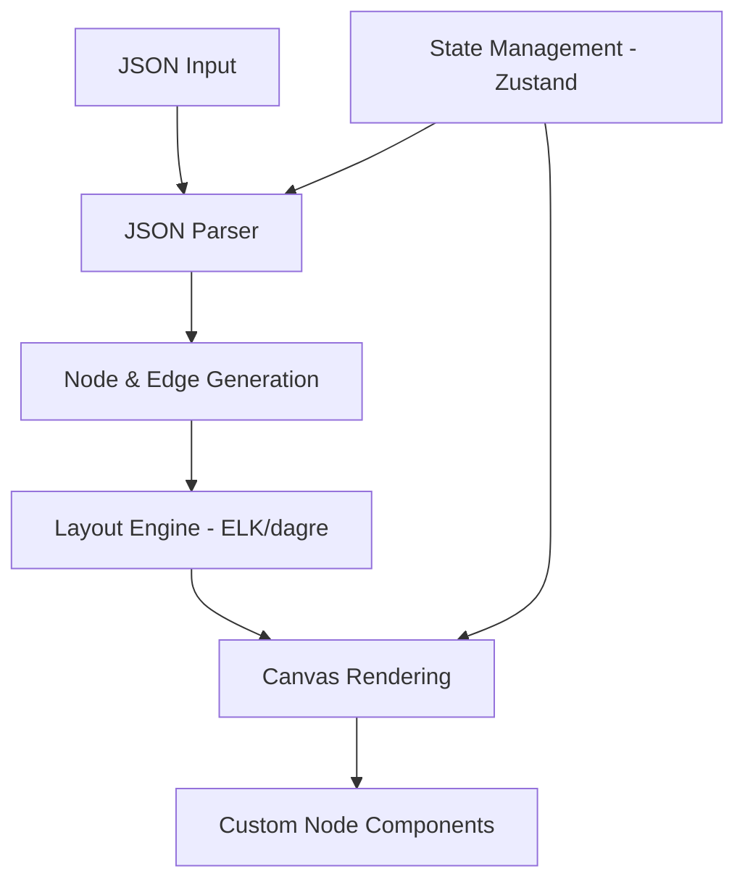

# JSONCrack Implementation Analysis

## Overview

JSONCrack is an open-source project (Apache-2.0) that provides JSON visualization. This document analyzes their approach to inform our implementation.

**Repository**: https://github.com/AykutSarac/jsoncrack.com

## Technology Stack

| Component | JSONCrack Uses | Our Choice |
|-----------|----------------|------------|
| Framework | Next.js | Vite + React |
| Graph Library | **Reaflow** (ELK layout) | **React Flow** (dagre layout) |
| Editor | @monaco-editor/react | @monaco-editor/react |
| State Management | Zustand | Zustand (recommended) |
| Styling | styled-components + Mantine | Tailwind CSS |
| Split Panes | allotment | allotment (recommended) |

## Architecture Overview



## Key Data Structures

### NodeData
```typescript
interface NodeRow {
  key: string | null;
  value: string | number | null;
  type: Node["type"];  // from jsonc-parser
  childrenCount?: number;
  to?: string[];
}

interface NodeData {
  id: string;
  text: Array<NodeRow>;  // Multiple rows per node
  width: number;
  height: number;
  path?: JSONPath;
}
```

### EdgeData
```typescript
interface EdgeData {
  id: string;
  from: string;
  to: string;
  text: string | null;
}
```

## JSON → Graph Conversion

JSONCrack uses `jsonc-parser` library which provides:
- AST-based JSON parsing
- Support for JSONC (JSON with comments)
- Path tracking for each node

### Algorithm Summary:
1. Parse JSON string into AST using `parseTree()`
2. Recursively traverse AST
3. For each node:
   - Create NodeData with unique ID
   - Calculate dimensions based on content
   - Track JSON path for navigation
4. Create EdgeData for parent-child relationships
5. Return `{ nodes, edges }`

## Node Types

JSONCrack renders two node types:
1. **ObjectNode** - For objects/arrays with keys
2. **TextNode** - For primitive values (strings, numbers, booleans, null)

Each node can contain multiple rows (key-value pairs) to reduce visual clutter.

## State Management Pattern

```typescript
// useJson store - manages raw JSON
const useJson = create((set, get) => ({
  json: "{}",
  setJson: (json) => {
    set({ json });
    useGraph.getState().setGraph(json);  // Triggers graph update
  },
}));

// useGraph store - manages visualization
const useGraph = create((set, get) => ({
  nodes: [],
  edges: [],
  direction: "RIGHT",
  setGraph: (json) => {
    const { nodes, edges } = parser(json);
    set({ nodes, edges });
  },
}));
```

## Performance Optimizations

1. **Size Limit**: Hard limit on node count (env variable)
2. **Debounced Updates**: Input changes are debounced before parsing
3. **Memoization**: React.memo on CustomNode components
4. **Lazy Layout**: Layout recalculates only when needed

## Key Insights for Our Implementation

1. **Use jsonc-parser** - Robust parsing with path tracking
2. **Multi-row nodes** - Group related key-values to reduce node count
3. **Zustand for state** - Clean separation of JSON and graph state
4. **allotment for split panes** - Good React split pane library
5. **ELK layout options** - Fine-tune node spacing and placement

## References

- [Reaflow](https://github.com/reaviz/reaflow) - Graph library used by JSONCrack
- [jsonc-parser](https://github.com/microsoft/node-jsonc-parser) - Microsoft's JSON parser
- [ELK](https://www.eclipse.org/elk/) - Eclipse Layout Kernel
