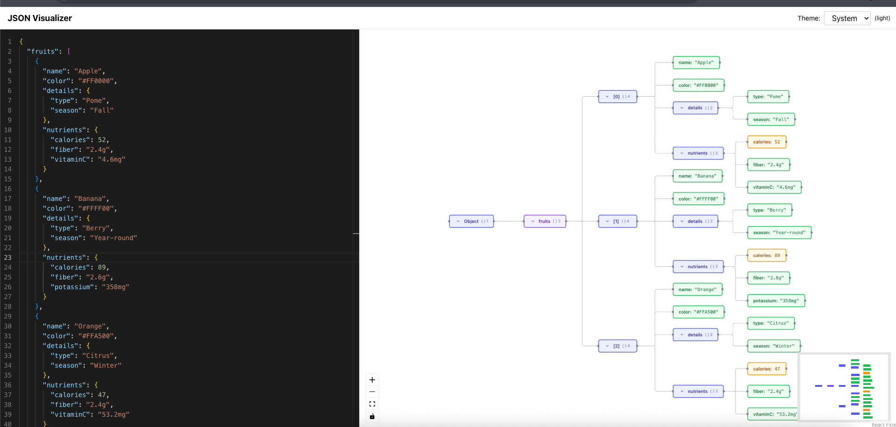

# JSON Visualizer

A performant JSON visualization and editing tool with an interactive graph interface. Edit JSON in a Monaco-powered editor and instantly see changes reflected in an expandable node graph.



## Features

- **Interactive Graph Visualization** - Visualize JSON as expandable/collapsible nodes with automatic layout
- **Monaco Editor Integration** - Full-featured JSON editor with syntax highlighting and validation
- **Performance Optimized** - Web Worker-based parsing handles large JSON files without blocking the UI
- **Dark/Light Theme** - Automatic theme detection with manual toggle support
- **Real-time Updates** - Debounced updates with size-aware performance tuning
- **Split Panel Interface** - Resizable editor and graph panels for optimal workflow

## Prerequisites

- Node.js 18+

## Quick Start

```bash
# Install dependencies
npm install

# Start development server
npm run dev

# Build for production
npm run build

# Preview production build
npm run preview
```

Open `http://localhost:5173` to start using the visualizer.
